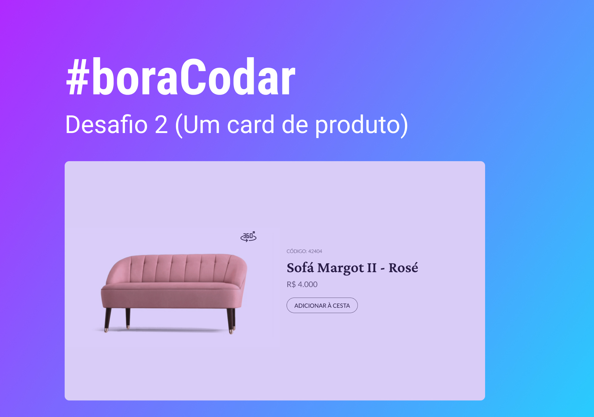

<h1 align="center"> #Bora codar </h1>

Segundo desafio do evento pra praticar conceitos basícos de HTML e CSS  

  <a href="#-tecnologias">Tecnologias</a>&nbsp;&nbsp;&nbsp;|&nbsp;&nbsp;&nbsp;
  <a href="#-projeto">Projeto</a>&nbsp;&nbsp;&nbsp;|&nbsp;&nbsp;&nbsp;
  <a href="#-layout">Layout</a>&nbsp;&nbsp;&nbsp;|&nbsp;&nbsp;&nbsp;
  <a href="#memo-licença">Licença</a>

  

 

  

## 🚀 Tecnologias

Esse projeto foi desenvolvido com as seguintes tecnologias:

- HTML, CSS e JavaScript
- Git e Github
- Figma

## 💻 Projeto

Projeto de um cartão de produto

## 🔖 Layout

Você pode visualizar o layout do projeto através [DESSE LINK](https://www.figma.com/file/2pl7WQXWkKoklVhwyAuxNP/%23boraCodar---Desafio-2-(Community)-(Copy)?node-id=103%3A95&t=5V6epV7raa70vEz4-0). É necessário ter conta no [Figma](https://figma.com) para acessá-lo.

---

Feito com ♥ by Marlison Mourão