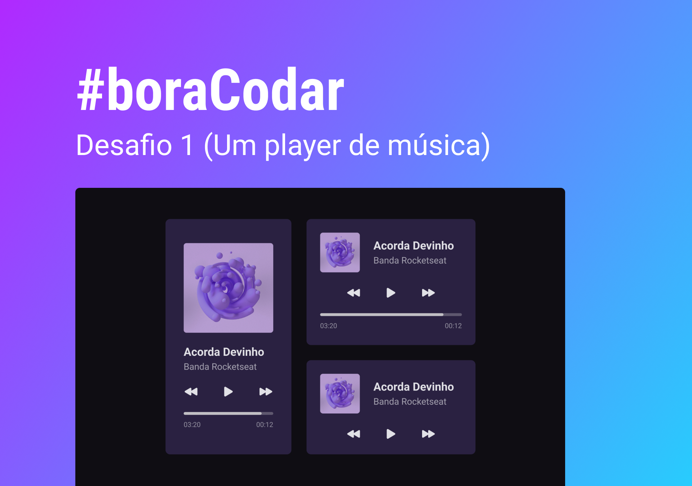

<h1 align="center"> #Bora codar </h1>

Primeiro desafio do evento pra praticar conceitos basícos de HTML e CSS  

  <a href="#-tecnologias">Tecnologias</a>&nbsp;&nbsp;&nbsp;|&nbsp;&nbsp;&nbsp;
  <a href="#-projeto">Projeto</a>&nbsp;&nbsp;&nbsp;|&nbsp;&nbsp;&nbsp;
  <a href="#-layout">Layout</a>&nbsp;&nbsp;&nbsp;

  

 

  

## 🚀 Tecnologias

Esse projeto foi desenvolvido com as seguintes tecnologias:

- HTML e CSS
- Git e Github
- Figma

## 💻 Projeto

Projeto estático de Player de Múscias

## 🔖 Layout

Você pode visualizar o layout do projeto através [DESSE LINK](https://www.figma.com/file/Vhq6ensax6u7hL5zRHqHoz/%23boraCodar---Desafio-1-(Community)?node-id=0%3A1&t=yreBSwTbo4BRwZb8-0). É necessário ter conta no [Figma](https://figma.com) para acessá-lo.

---

Feito com ♥ by Marlison Mourão